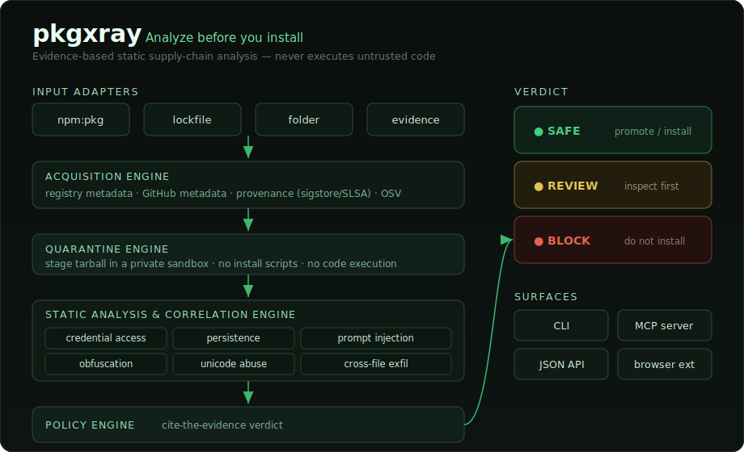

<div align="center">

# pkgxray

**Analyze packages before you install them.**

Local supply-chain security for AI agents & npm packages.
Zero-dependency Node, runs entirely on your machine, never executes untrusted code.



</div>

```bash
npm install -g pkgxray

pkgxray guard npm:some-package@1.2.3
```

Point it at a package, get a `SAFE` / `REVIEW` / `BLOCK` verdict with cited
evidence — before a single line of that package runs.

---

## Why pkgxray exists

AI coding assistants increasingly install packages automatically, often without
a human ever reading the code. Traditional antivirus inspects what *executes*;
**pkgxray inspects what gets *installed*** — evidence-based static analysis on a
package's metadata, source, provenance, and published artifact before it reaches
your machine.

It's intentionally conservative: it only reports evidence it can cite, and
stages everything in a sandboxed quarantine that never runs install scripts or
package code. Triage takes ~1 s/package with no execution risk.

---

## Detection Engine

**Supply-chain intelligence** — known CVEs (OSV, blocks *before* download),
sigstore/SLSA provenance, npm↔GitHub artifact divergence, registry metadata.

**Static code analysis** — credential/secret access (`.ssh`, `.aws`, `.npmrc`,
`.env`, keychains, wallets), persistence writes (shell rc, cron, launch agents),
obfuscation + execution (a packed blob decoded into `eval`/`new Function`/`vm`,
split-string paths), Trojan Source (bidi/zero-width Unicode), and **tiered
prompt-injection** detection in docs *and code comments* — reworded steering,
chat/role scaffolding (`<|im_start|>`, `<<SYS>>`, `[INST]`), and identity
reassignment, not just verbatim phrases.

**Behavioral correlation** — cross-file exfiltration, stage-2 loaders, download→
execute (`curl | sh`), `process.env` harvesting near a network sink.

Every signal resolves to one verdict:

| Verdict | Meaning |
|---|---|
| 🟢 `safe` | no high- or medium-risk indicators |
| 🟡 `review` | incomplete evidence or a privileged capability needing a human |
| 🔴 `block` | high-severity (prompt injection, credential access, persistence, obfuscation + execution, likely exfiltration) |

---

## Architecture

```
   INPUT ADAPTERS        npm: · lockfile · folder · evidence JSON
         │
   ACQUISITION ENGINE    registry meta · GitHub meta · provenance · OSV
         │
   QUARANTINE ENGINE     stage tarball in a private sandbox (no exec)
         │
   STATIC ANALYSIS       credentials · persistence · prompt-injection
   + CORRELATION         obfuscation · unicode · dynamic load · cross-file
         │
   POLICY ENGINE   →   SAFE · REVIEW · BLOCK
         │
   CLI · JSON · MCP server · browser extension
```

**Design principles:** never execute untrusted code · report only citable
evidence · explainability over black-box scoring · minimize false positives ·
operate offline whenever possible · zero runtime dependencies.

---

## Threat model

Malicious npm packages · compromised maintainer accounts · typosquatting &
dependency confusion · credential theft · malicious lifecycle scripts ·
supply-chain tampering (npm artifact ≠ tagged source) · provenance spoofing ·
AI prompt injection in package docs.

**Known blind spot:** pkgxray reasons about bytes in the tarball. A package that
downloads and runs its real payload *after* install can ship a clean tree.
pkgxray flags the *capability* when its shape is unambiguous, but pair it with
runtime/install-time sandboxing when that risk matters.

**Why few false positives:** validated against the 47 most-installed npm
packages with **0 false blocks**. READMEs run only the prompt-injection check
(never read as code); test/fixture/example files downgrade to `review`;
npm↔GitHub divergence is `review`, not auto-block (can't tell a build step from
tampering); URL shorteners count only when co-located with a capability. And
**minification is not obfuscation** — `eval`/`new Function` on a *string
literal* (a bundler's `eval-source-map` module wrapper, a `new Function("return
this")` globalThis probe) is recorded as info, not flagged; only `eval` on a
*computed* argument (`eval(atob(blob))`) gates. That keeps heavily-bundled
frontend packages out of the review pile.

---

## Quick start

```bash
# Guard an npm package before it reaches your machine
pkgxray guard npm:some-package@1.2.3
pkgxray guard npm:some-mcp-server@1.2.3 --format json

# Guard a local extension and promote it only if policy allows
pkgxray guard ./ext --promote-to ./approved/ext

# Audit a whole project's lockfile (batch OSV query)
pkgxray audit package-lock.json          # also: yarn.lock, pnpm-lock.yaml, package.json
pkgxray audit package-lock.json --deep    # full static/GitHub layer on each blocked dep

# Audit supplied evidence directly
pkgxray --file examples/evidence.json --format json
```

The guard flow stages the extension in a private quarantine, audits the staged
copy, and only promotes it when policy allows — it never runs `npm install`,
lifecycle scripts, build steps, or extension code. For npm references: resolve
metadata → query OSV → block before download if vulnerable → otherwise extract
into quarantine and run the static audit.

Decisions: `allow` (promotion ok), `review` (inspect quarantine first), `block`
(do not install). Only `safe` promotes by default; `--policy allow-review` also
promotes review-grade. Exit codes: `0` safe/allow, `2` block, `3` review.

---

## MCP Server

Use the stdio server from any MCP-capable agent:

```json
{ "mcpServers": { "pkgxray": { "command": "pkgxray-mcp" } } }
```

Tools: `audit_agent_extension_supply_chain` (static heuristics on supplied
evidence), `guard_agent_extension_install` (stage + vuln-check + audit a real
package, auto-fetches provenance), `audit_lockfile_supply_chain` (batch OSV scan
a lockfile), `triage_lockfile_supply_chain` (record each flagged dep as
`allow`/`block` into a sibling `.pkgxray.lock`).

---

## Reference

<details>
<summary><b>Severity policy</b> (what lands in block / review / info)</summary>

- **block** (HIGH) — verdict-forcing / rule-overriding prompt-injection text (in
  docs *or* a code comment); credential reads near a filesystem-read primitive
  (including paths assembled from split fragments — `".s"+"sh"` — folded by a
  light de-obfuscation pass); persistence writes; execution/outbound-network plus
  a hardcoded public IP / shortener / webhook; bulk `process.env` harvest in the
  same file as outbound network (sinks include `sendBeacon` / `EventSource` /
  `dns.*` / `dgram` / remote `import()`); a dynamic `require`/`import` of a
  computed name co-located with an env harvest; a stage-2 loader that reads an
  opaque blob and `eval`s it; a large encoded blob decoded into a **computed-arg**
  `eval` / `new Function` / `child_process`; split token-exfil across files.
- **review** (MEDIUM) — install/postinstall scripts; `eval` / `new Function` /
  vm on a **computed** argument; weaker prompt-injection (reworded steering,
  chat/role scaffolding like `<|im_start|>` / `<<SYS>>` / `[INST]`, identity
  reassignment); a lone dynamic `require`/`import` by computed name; a lone bulk
  `process.env` harvest; a path/domain assembled from split fragments; Trojan
  Source Unicode; a geo/locale-gated destructive op; download-then-execute;
  clipboard access; a lone exfil/callback domain; npm↔GitHub divergence; missing
  package.json or entrypoint.
- **info** — child_process/fetch/network in isolation; `eval` / `new Function` on
  a **string literal** (bundler `eval-source-map` wrapper, feature-detection
  probe — the executed text is in the artifact and scanned as code). Recorded,
  does not gate.

`.d.ts`, `.map`, `.min.js`, `.lock` files are skipped. Tarballs up to 20,000
entries / 256 MB uncompressed are scanned.
</details>

<details>
<summary><b>Performance</b></summary>

Local static analysis is ~25 ms; almost all of `guard`'s wall-clock is network
round-trips (registry, OSV, GitHub, provenance). Measured on an Apple M1
(Node 26), cold cache:

| Package | Weekly downloads | `guard` time |
|---|--:|--:|
| `is-number@7.0.0` | ~170M | ~1.3 s |
| `express@4.21.0` | ~110M | ~1.4 s |
| `commander@12.1.0` | ~444M | ~1.5 s |
| `chalk@5.3.0` | ~451M | ~1.5 s |

A known-vulnerable package blocks at the OSV precheck, before download. Point CI
at the cache server to collapse repeated GitHub fetches across runners.
</details>

<details>
<summary><b>JSON output</b></summary>

All JSON carries `schemaVersion: 1`; within `0.x` fields are additive only. Run
any command with `--format json`. Top-level fields:

- **audit / `--file`** — `verdict`, `grade`, `score`, `parameters`, `summary`,
  `riskBands[]`, `findings[]`
- **guard** — `decision`, `resolved`, `githubMetadata`, `npmVsGithubDiff`,
  `vulnerabilityPrecheck`, `timings`, `quarantinePath`, `promotedPath`, `report`
- **audit `<lockfile>`** — `file`, `format`, `totalDeps`, `uniqueDeps`,
  `summary`, `worstDecision`, `results[]`
</details>

<details>
<summary><b>Browser extension</b></summary>

`browser-extension/` is a Chrome-compatible Manifest V3 unpacked extension that
runs entirely locally and requests no browser permissions. Load it via
`chrome://extensions` → Developer Mode → **Load unpacked** → select the folder.
</details>

<details>
<summary><b>Self-hostable cache server</b></summary>

Every `guard` / `audit --deep` fetches GitHub metadata and tarballs; in CI that
duplicates traffic. Run a shared cache to collapse it into one fetch per
(repo, ref) per TTL window:

```bash
pkgxray-cache --port 8819 --cache-dir /var/cache/pkgxray
export PKGXRAY_CACHE_URL=http://cache.internal:8819
```

Routes: `GET /github/repos/{owner}/{repo}` (1h), `GET
/github/tarball/{owner}/{repo}/{ref}` (24h, streamed), `GET /healthz`. With
`PKGXRAY_CACHE_URL` unset, clients run the default path with zero overhead.

> **Trust model:** the cache is a transparent proxy, **not** an auth boundary —
> no login or rate limit. Run it on a private network or behind a reverse proxy
> that enforces your own auth. Never put it on a public network.
</details>

---

## Development

```bash
npm test
npm run build:browser
npm run audit:evidence -- --file examples/evidence.json
```

```
src/   analysis engines   bin/   CLI entrypoints   browser-extension/   MV3 ext
docs/  architecture        examples/  sample evidence   test/  node --test suites
```
