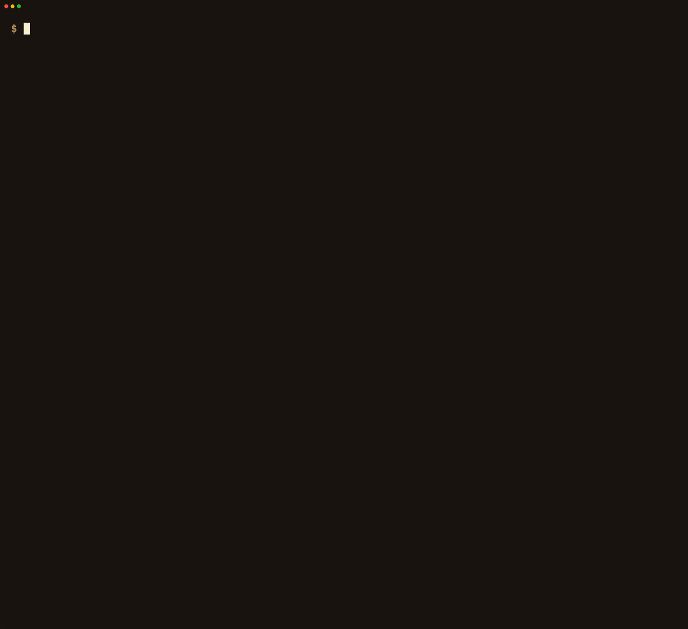

<div align="center">

# pkgxray — pre-install security for npm packages, MCP servers, and AI agents

**Inspect an npm package or MCP server before you install or connect to it, and
get a deterministic, evidence-backed `SAFE`, `REVIEW`, or `BLOCK` verdict.**

Use local, zero-dependency package static analysis to inspect npm packages and
Model Context Protocol (MCP) servers before installation or connection. pkgxray
reports cited `SAFE`, `REVIEW`, or `BLOCK` evidence without executing package
code during normal scans.

[](https://www.npmjs.com/package/pkgxray)
[](https://github.com/adamsjack711-ux/pkgxray/actions/workflows/pkgxray-test.yml)
[](https://github.com/adamsjack711-ux/pkgxray/actions/workflows/pkgxray-benchmark.yml)
[](LICENSE)

**Static analysis** · **Supply-chain intelligence** · **Prompt-injection detection** ·
**MCP security** · `SAFE` / `REVIEW` / `BLOCK`



<sub>Real runs: `guard` clears `express@4.21.0`, then blocks a sample modeled on
the 2024 `@solana/web3.js` compromise. **[▶ 60-second walkthrough](#demo)**</sub>

</div>

## Quick start

### 1. Scan a known-benign package without installing pkgxray

```bash
npx --yes pkgxray@1.0.4 guard npm:express@4.21.0
```

This downloads pkgxray through npm's temporary `npx` cache, stages the target
tarball in quarantine, and performs the static and supply-chain checks. It does
not globally install pkgxray, run `npm install`, execute lifecycle scripts, or
execute package code.

```text
Decision: **SAFE**
Grade: **A+** (99/100)

No high- or medium-risk indicators were found in the provided evidence.

Notes:
- **INFO npm-vs-github-clean** — npm tarball matches the linked GitHub repo
  at the published version. (15/16 files match GitHub @4.21.0)
…
```

<sub>Real output, abridged. A `BLOCK` verdict instead lists every finding with
the file and evidence that produced it.</sub>

### 2. Read the verdict

Point it at a package, get a verdict with cited evidence — before a single
line of that package runs. `guard` stages the package in a sandboxed
quarantine, audits the staged copy, and only promotes it when policy allows.
It never runs `npm install`, lifecycle scripts, build steps, or package code.

| Verdict | Exit | Meaning |
|---|---:|---|
| `SAFE` | `0` | No high- or medium-risk indicators were found; default policy permits promotion. |
| `REVIEW` | `3` | Evidence is incomplete or a privileged capability needs human review. |
| `BLOCK` | `2` | High-severity cited evidence requires rejection or deep investigation. |

`SAFE` is not a proof that a package is harmless; static analysis cannot see a
payload downloaded only at runtime. See the [threat model](docs/threat-model.md).

### 3. See a BLOCK on the supplied inert fixture

From a repository checkout:

```bash
npx --yes pkgxray@1.0.4 --file examples/onboarding-malicious.json --format markdown
```

The fixture contains inert source text that models a split-string SSH-key read
and network exfiltration. It is never executed. The command returns `BLOCK`
(exit `2`) and cites the matching file and evidence.

### 4. Add it to your workflow

- [Scan pull requests and schedule dependency rechecks](docs/reference.md#monitoring-pkgxray-recheck).
- [Expose pkgxray's tools to an MCP-capable coding agent](docs/mcp.md#the-pkgxray-mcp-server).
- [Evaluate the experimental Hookshot install gate](examples/hookshot/).

## Why pkgxray?

AI coding assistants install packages and connect to MCP servers at machine
speed, often without a human ever reading the code. Sonatype identified
**more than 454,600 new malicious open-source packages across monitored
ecosystems in 2025**, with over 99% of them on npm; its Q4 report counted
394,877 that quarter
([2025 malware](https://www.sonatype.com/state-of-the-software-supply-chain/2026/open-source-malware);
[Q4 index](https://www.sonatype.com/blog/open-source-malware-index-q4-2025-automation-overwhelms-ecosystems)).
Traditional antivirus inspects what *executes*; **pkgxray inspects what gets
*installed***.

`npm audit` and OSV-Scanner answer an essential question — *does this package
have a known CVE?* — and pkgxray asks it too (via OSV, before anything
downloads). But a freshly trojaned package has no CVE yet, so pkgxray also
analyzes **trust**: what the code actually does, whether the published npm
artifact matches the tagged GitHub source, whether the provenance attestation
is consistent with the claimed repository, and whether the docs carry a
prompt-injection payload aimed at the agent reading them.

It is intentionally conservative: verdicts come from deterministic heuristics
(no LLM in the verdict path, so injected text can't steer them), only
citable evidence is reported, and the **zero-heuristic-false-block calibration
on the top-1000 most-downloaded packages** is
[regression-gated in CI](docs/benchmark.md). That claim is scoped to the
most-installed set — it is *not* a claim of zero false blocks on every package;
the newer MCP/agent-tooling ecosystem is over-blocked and being reconciled
per-case ([details](docs/benchmark.md#scope-of-the-claim-read-this-first)).

## What it catches

| Threat | Coverage | How pkgxray sees it |
|---|:-:|---|
| Credential theft | ✅ | reads of `.ssh` / `.aws` / `.npmrc` / `.env` / keychains / wallets, incl. split-fragment paths (`".s"+"sh"`) |
| Prompt injection | ✅ | tiered detection in docs, comments, metadata; deterministic verdict path can't be steered |
| Unicode smuggling | ✅ | invisible tag-block characters + Trojan Source bidi / zero-width |
| Base64 payloads | ✅ | encoded envelopes in docs/comments; blobs decoded into computed-arg `eval` / `new Function` / `child_process` |
| Exfiltration & loaders | ✅ | cross-file correlation: stage-2 loaders, `curl \| sh`, `process.env` harvesting near a network sink, EtherHiding |
| Persistence | ✅ | writes to shell rc files, cron, launch agents |
| Obfuscation | ✅ | packed blob + computed-arg execution; minification alone is deliberately *not* flagged |
| Known CVEs | ✅ | OSV batch pre-check before download; never mutable by config |
| Trojaned updates / maintainer takeover | ✅ | `recheck` verdict-drift + version-drift monitoring |
| Artifact divergence | ✅ | published npm tarball diffed against the tagged GitHub source |
| MCP capability abuse | ✅ | capability-surface mismatch in the manifest audit (a `get_weather` that also takes a `command`) |
| Runtime tool drift | ✅ | `mcp-proxy` re-audits on `tools/list_changed`; pinned-manifest drift is denied |
| Sequence-level tool-call chains | ◑ | `mcp-proxy` gates each call and scans results; no cross-call flow analysis — [honest limits](docs/threat-model.md#sequence-level-attacks-chained-tool-calls) |
| Dependency confusion / typosquats | ◑ | callback beacons, repo-mismatch and provenance-mismatch signals; no name-similarity heuristic |

<sub>✅ detected · ◑ partial / indirect</sub>

**Known blind spot:** pkgxray reasons about bytes in the tarball. A package
that downloads its real payload *after* install can ship a clean tree —
pkgxray flags the capability when its shape is unambiguous, but pair it with
runtime sandboxing when that risk matters. Full analysis:
[docs/threat-model.md](docs/threat-model.md).

## Beyond detection

- **Continuous monitoring** — [`pkgxray recheck`](docs/reference.md#monitoring-pkgxray-recheck)
  diffs installed deps against a stored verdict baseline and pre-vets newer versions
- **MCP vetting** — `pkgxray mcp` audits a server's tool manifest before you
  connect; `--pin` / `--recheck` catch the rug-pull; `pkgxray-mcp` gives any
  agent the audit tools directly
- **Runtime gate** — [`pkgxray mcp-proxy`](docs/mcp.md#per-call-runtime-gate-pkgxray-mcp-proxy)
  wraps a live MCP server on the wire: denied tools stripped, ~0.05 µs per-call
  verdict, injection scan of tool results
- **Install gate** — a [hookshot](https://github.com/CorridorSecurity/hookshot)
  hook runs `guard` on every package an agent tries to install, across Claude
  Code, Cursor, Windsurf, Factory Droid, and Codex ([`examples/hookshot/`](examples/hookshot/))
- **Policy engine** — one `.pkgxray.json` read by every surface; tighten
  freely, every loosening is printed; CVEs can never be allowed away; fail closed
- **Opt-in behavioral canary** — [`pkgxray canary`](docs/canary-threat-model.md)
  runs lifecycle scripts in an OS sandbox with decoy credentials; it can
  *confirm* malice, never *clear* a package

## Verdicts

| Verdict | Meaning | You should |
|---|---|---|
| 🟢 `SAFE` | No high- or medium-risk indicators. | Install. Only `safe` promotes out of quarantine by default. |
| 🟡 `REVIEW` | Incomplete evidence, or a privileged capability that needs a human. | Inspect the quarantined copy before promoting. |
| 🔴 `BLOCK` | High-severity, cited evidence. | Do not install. Every finding names the file and evidence. |

Exit codes are stable and CI-friendly: **`0`** safe/allow · **`2`** block ·
**`3`** review. The full signal-to-severity mapping is in the
[severity policy](docs/reference.md#severity-policy-what-lands-in-block--review--info).

> **Two execution models.** Default `guard` and `audit` scans are **static** —
> package code is never executed. Enumerating an MCP server may spawn it and
> `mcp-proxy` runs it behind a gate; the opt-in
> [`canary`](docs/canary-threat-model.md) is the one deliberate exception that
> *executes* the package in a sandbox to confirm behavior. A `canary` run can
> confirm malice but can never prove a package safe. Full boundary:
> [SECURITY.md](SECURITY.md#scope).

## Usage

**Vet an npm package before installing**

```bash
pkgxray guard npm:some-package@1.2.3 [--format json]
pkgxray guard ./ext --promote-to ./approved/ext   # local dir, promote if policy allows
```

**Vet an MCP server before connecting** — full guide: [docs/mcp.md](docs/mcp.md)

```bash
pkgxray mcp --package npm:some-mcp-server@1.4.2 npx some-mcp-server
pkgxray mcp --recheck npx some-mcp-server   # catch the rug-pull
```

**Enforce in CI/CD**

```bash
pkgxray audit package-lock.json [--deep]    # also: yarn.lock, pnpm-lock.yaml, package.json
npx pkgxray recheck package-lock.json       # scheduled: exits non-zero only on a regression
```

A ready-made [GitHub Actions integration](docs/integrations/github-actions.md)
and the self-hostable cache server (`PKGXRAY_CACHE_URL`) are documented in the
[reference](docs/reference.md#monitoring-pkgxray-recheck).

**Guard AI coding agents**

pkgxray ships a built-in MCP server under the registry name
`io.github.adamsjack711-ux/pkgxray`. Add it to any MCP client — locally
installed (`pkgxray-mcp`) or zero-install via `npx` (this setup does not depend
on the [MCP Registry](https://registry.modelcontextprotocol.io), which is in
preview and may not currently list the entry):

```json
{
  "mcpServers": {
    "pkgxray": {
      "command": "npx",
      "args": ["--yes", "--package", "pkgxray@1.0.4", "pkgxray-mcp"],
      "env": { "PKGXRAY_MCP_ALLOWED_ROOTS": "/absolute/path/to/project" }
    }
  }
}
```

The [MCP guide](docs/mcp.md#the-pkgxray-mcp-server) explains the operator-owned
filesystem boundary. Product-specific setup is in the
[coding-agent integration guide](docs/integrations/coding-agents.md). Gate
installs with the [Hookshot integration](examples/hookshot/) and wrap MCP servers with
[`pkgxray mcp-proxy`](docs/mcp.md#per-call-runtime-gate-pkgxray-mcp-proxy).

## Integrations

One engine behind every entry point. "Works with" means a documented setup
guide, not a vendor-endorsed integration.

| Where | What it does | Guide |
|---|---|---|
| Coding agents — Codex, Claude Code, Cursor, Windsurf | Gate installs and expose the audit tools to the agent | [coding-agents.md](docs/integrations/coding-agents.md) |
| MCP clients | Vet a server before connect; run pkgxray itself as an MCP server | [mcp.md](docs/mcp.md) |
| GitHub Actions / CI | Fail a build when a dependency crosses policy | [github-actions.md](docs/integrations/github-actions.md) |
| Install gate — Hookshot | Run `guard` on every package an agent tries to install | [examples/hookshot/](examples/hookshot/) |
| Runtime MCP gate | Proxy a live MCP server and gate every tool call | [`mcp-proxy`](docs/mcp.md#per-call-runtime-gate-pkgxray-mcp-proxy) |
| Dependency monitoring | Re-vet installed deps and pre-vet upgrades on a schedule | [`recheck`](docs/reference.md#monitoring-pkgxray-recheck) |

## Configuration

One optional `.pkgxray.json`, read by every surface. Zero config means
maximum strictness.

```jsonc
{
  "policy": "safe-only",              // or "allow-review" (a loosening — warns)
  "failOn": "review",                 // CI exit threshold
  "scanErrorPolicy": "fail-closed",   // a scan that errors → review, never safe

  "allow": [
    { "pkg": "left-pad@1.3.0", "sha256": "e0b0…",
      "reason": "reviewed 2026-07", "expires": "2026-10-01" }
  ]
}
```

Precedence, `mute` / `mcp` blocks, and enforced invariants:
[docs/configuration.md](docs/configuration.md) ·
[`.pkgxray.example.json`](.pkgxray.example.json)

## Demo

The 60-second walkthrough — the SAFE run, the blocked trojan with its exit
code, then a lockfile audit:

https://github.com/user-attachments/assets/b5a323b1-a9ec-4676-9601-1b284df81b6b

<sub>All captures are real runs — reproduction steps in
[`docs/screenshots/`](docs/screenshots/README.md), which also shows the
MCP proxy, hookshot install gate, and browser extension in action.</sub>

## Comparison

`npm audit` and [OSV-Scanner](https://google.github.io/osv-scanner/) match
dependencies against known CVEs — a different question, answered well.
pkgxray is designed to run *alongside* them, not replace them (it queries OSV
itself, before anything downloads). The comparison that matters is against
tools in the same lane — behavioral supply-chain vetting:

| Capability | Socket.dev | OpenSSF Package Analysis | Cisco MCP Scanner | pkgxray |
|---|:-:|:-:|:-:|:-:|
| Fully local, zero-dependency, no account or cloud upload | — ¹ | ◑ ² | ◑ ³ | ✅ |
| Static behavior analysis of package code | ✅ | ✅ | ✅ | ✅ |
| Sandboxed execution (dynamic analysis) | — | ✅ ⁴ | ◑ (optional Docker) | ◑ (opt-in `canary`) ⁴ |
| npm ↔ GitHub artifact divergence | unknown | — | — | ✅ |
| Deterministic verdict path — no LLM an injection can steer | — ⁵ | ✅ | ◑ ⁵ | ✅ |
| Pre-install gate with a quarantined copy to review | ◑ ⁶ | — | — | ✅ |
| MCP server vetting before connect | — ⁷ | — | ✅ | ✅ |
| Per-call runtime gating of live MCP traffic | — | — | — ⁸ | ✅ (`mcp-proxy`) |
| Verdict-drift monitoring vs. a stored baseline | ✅ (cloud-side) | — | — | ✅ (local `recheck`) |

<!-- MAINTAINER: re-review this table against each competitor's public docs
     every 60–90 days and update the "Last reviewed" date below. -->

<sub>**Last reviewed against public documentation: 2026-07-21** (re-reviewed
every 60–90 days). A **—** means no equivalent capability was found in the
public documentation reviewed on that date — not that it was tested and found
absent; *unknown* means not publicly documented either way.<br>
¹ Socket's analysis runs in its cloud; Socket Firewall needs no account but
consults Socket's hosted intelligence on every install.
² Open source and self-hostable, but built as a registry-scale analysis
pipeline (Docker/gVisor), not an install-time developer gate.
³ The YARA analyzer runs locally; the LLM-as-judge and Cisco AI Defense
analyzers require API keys.
⁴ Both detonate packages in an OS sandbox. pkgxray's opt-in
[`canary`](docs/canary-threat-model.md) runs two phases — install lifecycle
scripts *and* the entry-point import — with decoy credentials behind
kernel-confined egress (`sandbox-exec` on macOS, a `bwrap`+netns namespace on
Linux), so the malicious-on-first-`require` shape that is pkgxray's stated
[blind spot](docs/threat-model.md#known-blind-spot) is observed. Still ◑ by
design, not for a confinement gap: canary is opt-in and *confirm-only* (it
proves malice, never *clears* a package), whereas OpenSSF Package Analysis runs
registry-scale and default-on. Confinement levels, the `npm run verify:netns`
self-test, and threat model:
[docs/canary-threat-model.md](docs/canary-threat-model.md#isolation-levels).
⁵ Socket's LLM-based code inspection is a headline feature
(&ldquo;AI-detected potential malware&rdquo;, human-confirmed); Cisco's YARA-only mode
is deterministic, its LLM analyzer is not.
⁶ Socket Firewall blocks risky packages at install time; it does not stage a
quarantined copy for human review.
⁷ Socket's MCP offering exposes its package-scoring API *to* agents; it does
not vet arbitrary MCP servers at connect time.
⁸ Cisco MCP Scanner is analysis-only per its docs — it does not proxy or gate
live MCP traffic.</sub>

## Architecture


Acquisition (OSV pre-check → fetch) → sandboxed quarantine → static analysis →
policy → verdict. The same engine backs every surface: CLI, MCP server,
runtime proxy, install hook, browser extension, and CI cache server.
Principles: never execute untrusted package code in the default static-analysis
path · citable evidence only · minimize false positives · fail closed · zero
runtime dependencies.

Details: [docs/architecture.md](docs/architecture.md) ·
[docs/design.md](docs/design.md)

## Performance

- **Local static analysis: ~25 ms** — a full guard of `express` is ~1.3–1.5 s
  cold-cache, almost all network round-trips (Apple M1, Node 26)
- **Known-vulnerable packages block at the OSV pre-check**, before download
- **Calibration** (precision, recall, the 0-heuristic-false-block gate on the
  top-1000 most-downloaded — [scope](docs/benchmark.md#scope-of-the-claim-read-this-first))
  is measured by a committed [benchmark corpus](benchmark/) that fails CI when it regresses

Full numbers: [docs/reference.md#performance](docs/reference.md#performance) ·
methodology: [docs/benchmark.md](docs/benchmark.md)

## Documentation

| Doc | What it covers |
|---|---|
| [architecture.md](docs/architecture.md) | Pipeline, surfaces, repo layout |
| [threat-model.md](docs/threat-model.md) | Scope, blind spots, prompt-injection stance |
| [mcp.md](docs/mcp.md) | MCP server, connect-time vetting, runtime proxy |
| [mcp-registry.md](docs/mcp-registry.md) | Registry entry and release verification |
| [configuration.md](docs/configuration.md) | `.pkgxray.json` schema and invariants |
| [reference.md](docs/reference.md) | Severity policy, `recheck`, JSON output, cache server |
| [benchmark.md](docs/benchmark.md) | Calibration benchmark & real-world validation |
| [compatibility.md](docs/compatibility.md) | The 1.0 compatibility contract |
| [json-schema.md](docs/json-schema.md) | Full `--format json` schema |

Start at the [documentation index](docs/README.md). Longer-term plans:
[project status](docs/project-status.md), [adoption playbook](docs/adoption.md),
and GitHub issues.

## Development

```bash
npm test                 # zero-dep node --test suite
npm run benchmark        # calibration corpus: precision/recall + 0-false-block gate
npm run build:browser    # build the MV3 browser extension
```

Contributions are welcome; read [CONTRIBUTING.md](CONTRIBUTING.md) and the
[Code of Conduct](CODE_OF_CONDUCT.md) before opening a pull request.

## Security & license

Releases are published to npm with provenance (SLSA attestation), gated on the
test suite, the calibration benchmark, and pkgxray's own supply-chain guard.
To report a vulnerability in pkgxray itself, see [SECURITY.md](SECURITY.md).

[MIT](LICENSE)
